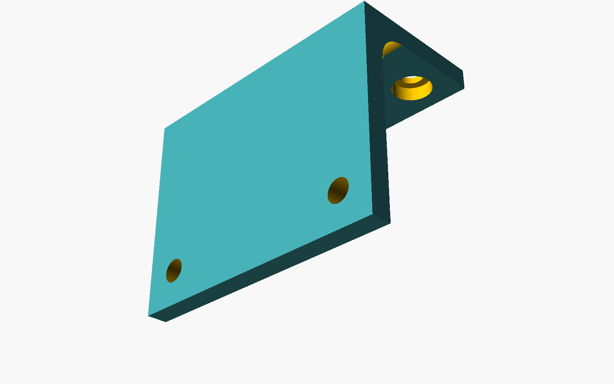

<div align="center">

# CAD Portfolio

**by Katherine Feemster**

### Senior CAD Professional · Parametric Design · BIM · CAD-for-AI

[🌐 **Live portfolio site**](https://katherinejenniferhsfeemster.github.io/cad-portfolio/) · [GitHub repo](https://github.com/katherinejenniferhsfeemster/cad-portfolio)

      

*Ten years designing parts, buildings and reproducible 3D datasets — now helping AI research teams turn CAD into structured training data.*

</div>

---

## Contents

- [Highlighted projects](#highlighted-projects)
- [Reproducibility](#reproducibility)
- [Tech stack](#tech-stack)
- [Editorial style](#editorial-style)
- [Repo layout](#repo-layout)
- [About the author](#about-the-author)
- [Contact](#contact)

---

## Hero



---

## Highlighted projects

| Project | Stack | What it proves |
| :-- | :-- | :-- |
| **[Parametric Mounting Bracket](projects/parametric-bracket/)** | OpenSCAD, FreeCAD | Code-driven part family with 7 parameters and auto-generated drawings. |
| **[BIM Office Module (IFC 4.3)](projects/bim-office-module/)** | FreeCAD BIM, BlenderBIM | Small office modeled to IFC 4.3 with MEP and clash notes. |
| **[Two-Stage Reduction Gearbox](projects/mechanical-gearbox/)** | Inventor, AutoCAD Mechanical, SolveSpace | Full mechanical assembly, tolerance stack-up, shop drawings. |
| **[Freeform Lounge Chair](projects/rhino-freeform-chair/)** | Rhino 3D, Grasshopper | Class-A surfacing, SubD-to-NURBS workflow. |
| **[CAD → AI Dataset Pipeline](projects/ai-dataset-pipeline/)** | FreeCAD Python, OpenSCAD, Blender | 10k parametric parts exported as STEP + labeled point clouds for ML. |

---

## Reproducibility

```bash
pip install -r requirements.txt
python scripts/python/render_figures.py
```

Each figure on the live site is rendered headlessly from the scripts in `scripts/` — nothing is pre-baked.

---

## Tech stack

- **Mechanical & product design** — AutoCAD, Inventor, SolveSpace, FreeCAD · GD&T, ASME Y14.5, tolerance stack-ups, shop drawings.
- **Parametric & code-CAD** — OpenSCAD, FreeCAD Python, Grasshopper, CadQuery · parametric part families, DFM rules as code.
- **BIM & architecture** — FreeCAD BIM, BlenderBIM / Bonsai, VectorWorks · IFC 2x3 / 4 / 4.3, IfcOpenShell, BCF, clash detection.
- **Interchange & QA** — STEP (AP214/AP242), IGES, STL, 3MF, DXF, DWG, IFC, glTF · mesh repair, watertightness audits.
- **Scripting & tooling** — Python, a bit of Rust and C++ for OCCT, Git, GitHub Actions, Docker, Linux.

---

## Editorial style

- **Palette** — teal `#2E7A7B` + amber `#D9A441` on ink `#0F1A1F` / paper `#FBFAF7`.
- **Type** — Inter (UI) + JetBrains Mono (code, netlists, timecode).
- **Determinism** — every generator is seeded; PNG, CSV and project-file bytes are stable across CI runs.
- **Licensing** — every tool in the pipeline is FOSS. No commercial SDK in the dependency tree.

---

## Repo layout

```
cad-portfolio/
├── projects/                    # one folder per case with its own README
├── scripts/                     # OpenSCAD, FreeCAD Python, BlenderBIM scripts
├── docs/                        # GitHub Pages site
└── .github/workflows/           # CI regenerates every figure on push
```

---

## About the author

Senior CAD professional with a decade of hands-on experience spanning mechanical design, architectural BIM, industrial product modeling, and — most recently — building CAD datasets for AI research. Clean topology, parametric rigour, IFC correctness, and scripts that still build the same part a year from now.

Open to remote and contract engagements. This repository is the living portfolio companion to my CV.

---

## Contact

**Katherine Feemster**

- GitHub — [@katherinejenniferhsfeemster](https://github.com/katherinejenniferhsfeemster)
- Live site — [katherinejenniferhsfeemster.github.io/cad-portfolio](https://katherinejenniferhsfeemster.github.io/cad-portfolio/)
- Location — open to remote / contract

---

<div align="center">
<sub>Built diff-first, editor-second. Every figure on this page is produced by code in this repo.</sub>
</div>
